[](https://github.com/ilia-pavlov/OpenBoard/actions/workflows/ci.yml)
<h1 align="center">♟️ OpenBoard</h1>

<p align="center">
  <strong>A fast, beautiful iOS &amp; iPadOS client for US Chess ratings.</strong><br>
  <em>The ratings app chess parents and players actually want.</em>
</p>

<p align="center">
  
  
  
  
  
</p>

<p align="center">
  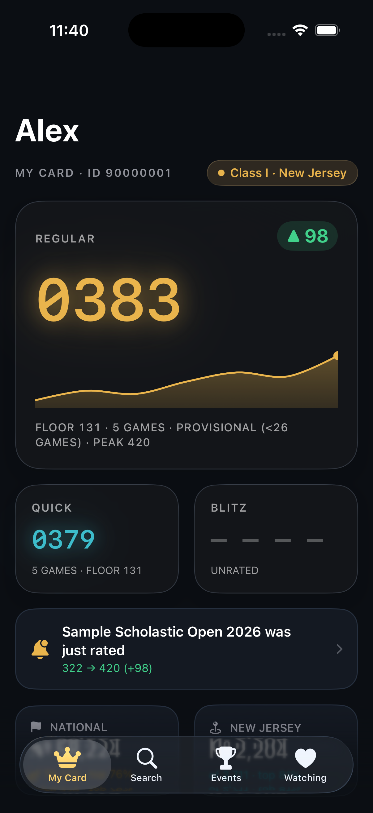
  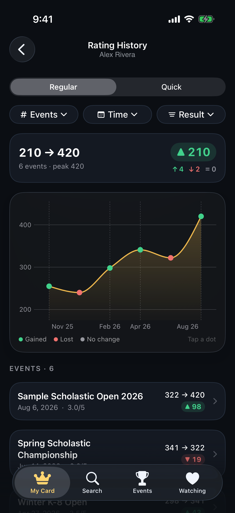
  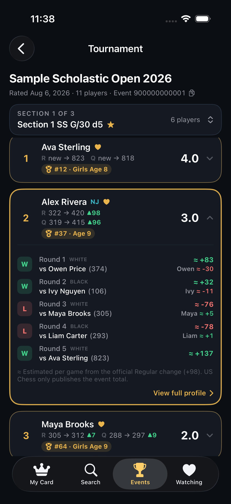
  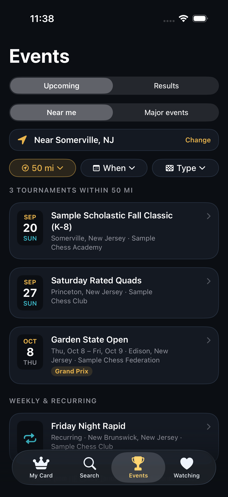
</p>

---

## ♞ What is OpenBoard?

The official US Chess app is an event check-in tool, and the ratings website
(ratings.uschess.org — **MUIR**) is slow on mobile. OpenBoard is a native client
that makes following [**US Chess (USCF)**](https://new.uschess.org) ratings — and
finding the next tournament to play — fast and delightful:

- **♛ My Card** — your player's ratings as glowing chess-clock digits, with a rating
  line, a "just rated" banner, national + state rank, and recent events.
- **📈 Rating History** — tap any rating card to see every rated event as a chart:
  each tournament is a dot, **green if the rating went up, red if it went down, gray
  if unchanged**. Filter by Regular / Quick, number of events, time period, or result;
  every event opens its crosstable. Loads a player's **entire** career, not just
  recent events.
- **🏆 Crosstables** — full event and section names, a section picker for big
  events, and rating changes on every row. **Tap a player to see each round** — the
  opponent, their rating, and an **estimated rating change for both players**
  (US Chess only publishes the event total; estimates always add up to it).
- **🗺️ Upcoming tournaments** — US Chess tournaments **near you** (25 / 50 / 100 /
  200 mi, this weekend / 30 days / 3 months, scholastic / quads / Grand Prix) plus
  nationwide **major events**. Each tournament shows the date and weekday, a venue
  map with **directions**, a **Register** button, the full announcement, and
  organizer contacts.
- **🏅 Top 100 by age** — browse US Chess's monthly Top 100 lists (age 7 & under
  through 18, girls, 50+, 65+; Regular / Quick / Blitz; your state only). Players on
  a list get a badge like **#37 · Age 9** everywhere they appear — My Card,
  profiles, Watching, search results, and tournament standings.
- **🔍 Search** — one field for players (name or 8-digit member ID) and tournaments
  (12-digit event ID), plus a shortcut to the Top 100 lists.
- **👤 Player profiles** — Regular / Quick / Blitz, **live vs published** ratings side
  by side, USCF class title, rankings, full event history, and a tap-to-copy
  member ID.
- **❤️ Watching** — follow your kid, rivals, and teammates; get a local notification
  when a followed player's rating changes.

Built with **SwiftUI**, **Swift 6**, **SwiftData**, and the iOS 26 **Liquid Glass**
material language. Universal (iPhone + iPad), with **zero third-party dependencies**.

> **Data sources:** ratings come from US Chess's **MUIR** platform (built by Leago);
> upcoming tournaments come from US Chess's **Tournament Life Announcements** and
> **Plan Ahead Calendar** on [new.uschess.org](https://new.uschess.org/upcoming-tournaments).
> &nbsp;·&nbsp; [US Chess](https://new.uschess.org)
> &nbsp;·&nbsp; [Ratings site](https://ratings.uschess.org)
> &nbsp;·&nbsp; [What is MUIR?](https://new.uschess.org/news/introducing-muir-member-uploads-information-and-reporting)
>
> *Not affiliated with or endorsed by the US Chess Federation.*

---

## 🚀 Install & run

Requires **macOS with Xcode 26+** and [XcodeGen](https://github.com/yonaskolb/XcodeGen).

```bash
git clone https://github.com/ilia-pavlov/OpenBoard.git
cd OpenBoard
brew install xcodegen           # if not already installed
xcodegen generate               # writes OpenBoard.xcodeproj from project.yml
open OpenBoard.xcodeproj         # then ⌘R on an iOS 26 simulator
```

- **Xcode 26+, Swift 6.** Deployment target iOS/iPadOS 26.0.
- **Zero third-party dependencies.** No SPM packages, no CocoaPods.
- Universal: iPhone (`TabView`, 4 tabs) and iPad (`NavigationSplitView`, sidebar + detail).

### Live vs mock — one flag

The whole app runs on either live network data or bundled seed data, switched in
**one place** — `AppEnvironment.dataSource` in `Services/RatingsProviding.swift`:

```swift
static var dataSource: DataSource {
    ProcessInfo.processInfo.arguments.contains("-mock") ? .mock : .live
}
```

- **Default = live.** The API probe (below) confirmed the backend is reachable and
  stable, so shipping defaults to `LiveRatingsService`.
- **`-mock` launch argument** forces `MockRatingsService` (used by UI tests, SwiftUI
  previews, and the screenshot pipeline). The app compiles, runs, and demos
  perfectly with **zero network** in this mode.

Everything above the service protocol (`RatingsProviding`) is identical in both
modes — the UI only ever sees the domain models.

---

## 🎮 Using the app

1. **Set up your card.** Open **Search**, find your player by name or 8-digit member
   ID, open their profile, and tap **♥ Watch**. Your first watched player automatically
   becomes your **My Card** home screen.
2. **Follow rivals & friends.** Watch more players — they appear under **Watching**.
   Long-press a row → *Make primary* to switch whose card is shown.
3. **See the whole journey.** Tap the rating card on My Card or any profile to open
   **Rating History** — every event as a green/red/gray dot, with filters.
4. **Open a tournament.** Tap any event (or go to **Events → Results** and paste a
   12-digit event ID). Pick a section from the section picker, then **tap any row**
   to see each round with estimated rating changes for both players. Followed
   players are outlined in gold and auto-scrolled to.
5. **Find the next tournament.** **Events → Upcoming → Near me** lists US Chess
   tournaments around your current location (or a city/ZIP you type). Tap one for
   the map, directions, and the **Register** link. **Major events** lists national
   championships and big-prize events nationwide.
6. **Browse the Top 100.** **Search → Top 100 lists** shows the best players by age,
   girls, and seniors — or just your state. Badges like **#37 · Age 9** show up next
   to ranked players everywhere in the app.
7. **Track changes.** OpenBoard polls followed players in the background and fires a
   local notification when a rating updates.

No account or sign-in. Reads fully from cache when offline, and ships a **zero-network
demo mode** (`-mock` launch argument) with synthetic sample data.

---

## API probe findings

The app talks to **MUIR** (*Member Uploads, Information, and Reporting*) — US Chess's
official ratings/reporting platform, built by their partner Leago
([announcement](https://new.uschess.org/news/introducing-muir-member-uploads-information-and-reporting)).
It publicly serves an OpenAPI/Swagger spec but isn't a formally documented,
supported public API, so it's treated as subject to change.

- **Spec:** https://ratings-api.uschess.org/swagger/v1/swagger.json
- **Reference client (unofficial, Go):** https://github.com/mikeb26/uschess-go

> **The task's first step was to probe the backend before writing any UI.** Here's
> what was found on **2026-08-08** using a real US Chess member ID and event ID.
> (All IDs/names below — and everywhere in this repo — are synthetic samples; no
> real member's data is committed.)

### The candidate endpoints from the spec all 404'd…

Every path in the original prompt (`/players/{id}`, `/player/{id}`, `/search`,
`/events/{id}`, `/openapi.json`, `/docs`, …) returned **404**. But `/swagger`
returned a **301** redirect — a lead.

### …but the service publishes a full Swagger/OpenAPI spec

```
https://ratings-api.uschess.org/swagger/index.html      → Swagger UI
https://ratings-api.uschess.org/swagger/v1/swagger.json → OpenAPI v1 (226 KB, ~50 paths)
https://ratings-api.uschess.org/swagger/v2/swagger.json → OpenAPI v2 (members-focused)
```

The real API is **versioned under `/api/v1`** (not the bare paths the spec guessed).
All of these returned **200 with real JSON**:

| Purpose | Endpoint (base `https://ratings-api.uschess.org/api/v1`) |
|---|---|
| Player profile | `GET /members/{memberId}` |
| Player's rated events | `GET /members/{memberId}/events` |
| Player's rating history (pre→post per section) | `GET /members/{memberId}/sections` |
| Name / ID search | `GET /members?search={query}` |
| National + per-state population totals (for percentiles) | `GET /members/max-ranks` |
| Tournament (with section list) | `GET /rated-events/{eventId}` |
| Section metadata | `GET /rated-events/{eventId}/sections/{number}` |
| **Crosstable standings** (with round-by-round) | `GET /rated-events/{eventId}/sections/{number}/standings` |
| Top 100 list catalog (age / gender / rating type) | `GET /top-players` |
| One Top 100 list (monthly) | `GET /top-players/{listId}` |

### Upcoming tournaments (new.uschess.org)

MUIR only knows about events **after** they're rated, so upcoming tournaments come
from the US Chess website, which isn't an API either — `TournamentParser` reads:

| Purpose | Source |
|---|---|
| Search with **distance from a city/ZIP** | `new.uschess.org/upcoming-tournaments?field_geofield_proximity[value]=50&…[origin_address]=Somerville, NJ` (HTML, 30 per page) |
| One announcement (dates, venue, coordinates, organizer, full text) | `new.uschess.org/{announcement-path}?_format=json` |
| Major events nationwide | `new.uschess.org/plan-ahead-calendar` (HTML) |

The site's event-type filter returns nothing and it has no date filter, so the
**When** and **Type** filters run on the device. The device's location is turned into
a city name with `MKReverseGeocodingRequest` (the search accepts a city or ZIP, not
coordinates). Registration links are picked out of the announcement text; when
there isn't one, the organizer's website is used.

### Actual JSON shapes

**`/members/{memberId}`** — ratings are an *array* keyed by `ratingSystem`
(`R`/`Q`/`B`/`OR`/`OQ`/`OB`), not the nested object the domain model uses
(values below are synthetic samples):

```json
{
  "id": "90000001", "firstName": "ALEX", "lastName": "RIVERA",
  "stateRep": "NJ", "rank": 58224, "stateRank": 2204, "gender": "Female",
  "ratings": [
    { "ratingSystem": "R", "rating": 383, "gamesPlayed": 5, "isProvisional": true, "floor": 131 },
    { "ratingSystem": "Q", "rating": 379, "gamesPlayed": 5, "isProvisional": true, "floor": 131 },
    { "ratingSystem": "B", "isProvisional": true }
  ]
}
```

**`/members/{memberId}/sections`** — this, not `/events`, carries the pre→post rating
deltas, under `ratingRecords[].preRating/postRating` keyed by `ratingSource`:

```json
{ "items": [ {
  "sectionName": "Section 1 SS G/30 d5",
  "ratingRecords": [
    { "preRating": 322, "postRating": 420, "ratingSource": "R", "postProvisionalGameCount": 12 },
    { "preRating": 319, "postRating": 415, "ratingSource": "Q", "postProvisionalGameCount": 12 }
  ],
  "event": { "id": "900000000001", "name": "SAMPLE SCHOLASTIC OPEN 2026", "startDate": "2026-08-06" }
} ] }
```

**`/rated-events/{id}/sections/{n}/standings`** — paginated (response has `items`,
`hasNextPage`, `offset`, `pageSize`); each standing has `ordinal`, `score`
(a `Double`), a `ratings[]` array (same pre/post shape), and full `roundOutcomes[]`
with opponent member IDs and colors. This is what powers the crosstable, including
the iPad's round-by-round pills.

### Notable quirks handled in the decoding layer

- **Query parameters are PascalCase, and unknown ones are silently ignored.** Fuzzy
  name search is `?Fuzzy=`, and pagination is `?Offset=`/`?Size=` — *not* `search`,
  `offset`, `pageSize`. (A wrong param name doesn't error; it just returns the
  default top-rated list / default page — an easy, silent bug. Confirmed against
  the spec + live API.)
- **Names are ALL CAPS** for many records (`"MAGNUS CARLSEN"`). `USCFMapper` title-cases
  shouty names and leaves mixed-case ones alone.
- **Ratings are arrays**, flattened into the `Ratings` struct by `ratingSystem` code.
- **`ratingSource` vs `ratingSystem`** — the same concept is named differently on
  member-sections vs standings; the DTO exposes a unified `system` accessor.
- **Percentiles aren't returned** — computed from `rank` + `/members/max-ranks`
  population totals (national = `76,379`; NJ = `2,711`).
- **Pages are capped at 100.** A player's sections are fetched page by page until
  `hasNextPage` is false — active juniors can have hundreds of rated sections.
- **No ages or birth dates.** Being on a Top 100 age list is the only age signal, so
  badges come from indexing the lists (`TopListsIndex`, cached 12 h).
- **Score is numeric** (`4.0`, `2.5`); formatted to `"3.0"` display strings.
- No auth is required; the app sends `User-Agent: OpenBoard-iOS/1.0`.

### What was mocked

Nothing had to be. Every screen's data maps to a live endpoint. `MockRatingsService`
exists only as the offline/demo/test data source, built entirely from **synthetic
sample players and events** (e.g. member `90000001`, event `900000000001`) — no
real member's data is baked into the app.

> **Caveat:** MUIR publishes a Swagger spec but isn't a formally supported public
> API, so it can change without notice. All endpoint knowledge is isolated to
> `Services/LiveRatingsService.swift` +
> `Services/USCFAPITypes.swift`, so a rename is a one-file fix that never touches
> the domain models or the UI. The fixtures in `OpenBoardTests/Fixtures/` mirror
> the real API's JSON *shape* using synthetic sample values, and back the decoding
> tests.

---

## Architecture

Lightweight **MV** (Model–View) — no view-model ceremony.

```
OpenBoard/
├── App/            OpenBoardApp, AppModel (@Observable), RootView (tab vs split routing)
├── Models/         Domain contract: Player, Ratings, ChessEvent, Standing, ClassTitle,
│                   RoundRatingEstimator, UpcomingTournaments, TopLists …
├── Services/       RatingsProviding protocol + Live / Mock / Cached decorator,
│                   USCFAPITypes (wire DTOs + mapper), CacheStore (SwiftData),
│                   TournamentsService (new.uschess.org + TournamentParser),
│                   TopListsIndex (Top 100 badges), LocationProvider,
│                   RefreshScheduler (BGAppRefreshTask + notifications)
├── Components/     Theme, ClockDigits, Sparkline, RatingCards, Badges, FilterChip,
│                   ShareCard, States
└── Views/          MyCardView, SearchView, PlayerProfileView, RatingHistoryView,
                    CrosstableView, EventsView, UpcomingTournamentsView,
                    TournamentDetailView, TopListsView, WatchlistView
```

- **`RatingsProviding`** is the seam. `LiveRatingsService` (an `actor`) talks HTTP;
  `MockRatingsService` serves seed data; `CachedRatingsService` wraps either one with
  a SwiftData cache.
- **Concurrency:** `async/await` throughout. The networking layer is an `actor` with
  **in-flight request de-duplication** (identical URLs share one call). The cache is a
  SwiftData `@ModelActor`. No Combine.
- **Caching (stale-while-revalidate):** player/event responses are persisted with a
  **5-minute TTL**. Fresh entries serve instantly with no network; stale entries paint
  immediately, then refresh in the background. On failure the last cached copy is
  served, and the UI shows *"showing cached from 3:12 PM"* with Retry.
- **Persistence:** SwiftData models `WatchedPlayer`, `CachedPayload`, `RecentSearch`.
  The app launches with an empty watchlist — the user searches for their own
  player (the first one watched becomes primary / "My Card") and looks up
  tournaments by event ID. Nothing is pre-seeded.
- **Background refresh:** `BGAppRefreshTask` (`com.iliapavlov.openboard.refresh`) polls
  followed players ~2×/day; a changed rating fires a local notification
  (*"Alex's new rating: 420 (+98) 🎉"*). Manual
  pull-to-refresh triggers the same check.

## Liquid Glass design

- **Chrome uses real system glass:** the tab bar, sidebar, and toolbars are standard
  components, so they get Liquid Glass for free — never custom-drawn.
- **`glassEffect(...)`** on the hero rating "clock face" cards; **`GlassEffectContainer`**
  groups them for correct blending. `.buttonStyle(.glass)` / `.glassProminent` on the
  Watch toggle, section actions, and CTAs.
- Glass stays on the chrome layer only; content stays opaque and high-contrast
  (no glass-on-glass). System materials handle Reduce Transparency / Increase Contrast.
- **Signature element:** ratings rendered as zero-padded chess-clock digits in
  monospaced SF, gold with a soft glow (`ClockDigits` / `HeroClockDigits`); unrated
  shows a ghosted `– – – –`.
- **Palette:** background `#0B0E13`, cards `#141922`, hairlines `#26303F`, gold
  `#E9B44C`, teal `#3DBCCB`, up-green `#41D18B`, down-red `#F0716E` — all adaptive
  for light mode via `Color(dynamicDark:light:)`.
- **Charts:** rating sparkline is Swift Charts `LineMark` + gradient `AreaMark` with a
  dotted last point.
- **Haptics:** `.sensoryFeedback` on the watch toggle and pull-to-refresh completion.

## The dual live-vs-published rating (a core feature)

USCF publishes official ratings on a delay, which confuses everyone. The player
profile shows **LIVE** (post-event, gold clock digits) and **PUBLISHED** (ghosted)
side by side, with a note when they differ — see `DualRatingCard` and the profile
screenshot below.

## Accessibility

- Dynamic Type through XXL — clock digits scale via `@ScaledMetric` and layouts reflow.
- VoiceOver labels read naturally (*"Regular rating three hundred eighty-three, up ninety-eight"*).
- Reduce Motion disables the skeleton shimmer; system materials cover the rest.
- All strings are `String(localized:)` / catalog-ready; US English ships.

---

## Tests

```bash
xcodebuild test -project OpenBoard.xcodeproj -scheme OpenBoard \
  -destination 'platform=iOS Simulator,name=iPhone 17 Pro,OS=26.5' \
  GENERATE_INFOPLIST_FILE=YES   # the test targets don't set an Info.plist in project.yml
```

- **Unit (Swift Testing, 31 tests / 7 suites):** decoding of **synthetic fixtures that
  mirror the real API shape** (member, sections, standings-with-rounds, search,
  max-ranks, Top 100 lists), USCF class-title mapping (17 parameterized cases), delta
  math + clock-digit formatting, cache TTL logic, **per-round rating estimates**
  (rounds add up to the official change; byes/new players skipped), **upcoming
  tournament parsing** against saved US Chess pages, the **Top 100 badge index**, and
  multi-page loading.
- **UI (XCTest, 6 tests, mock service):** search → profile → crosstable; My Card →
  Rating History → crosstable; another player's profile → Rating History; section
  picker; Upcoming → tournament detail; Search → Top 100 → profile badge.

All green on the iOS 26.5 simulator.

## Definition of done — status

- ✅ Builds clean on iOS 26 simulator (Swift 6, no warnings-as-errors surprises).
- ✅ Runs fully on mock data with **zero network** (`-mock`).
- ✅ Flips to live data by changing one `AppEnvironment` flag — **and the probe
  succeeded, so live is already the default.**
- ✅ Unit + UI tests pass.
- ✅ Dark-mode screenshots of every screen on iPhone 17 Pro and iPad Pro 13".

## 📱 Screenshots

> Shown with synthetic sample data — no real member's information is used.

### iPhone 17 Pro

| My Card | Rating History | Player profile | Crosstable (tap to expand) |
|:---:|:---:|:---:|:---:|
|  |  | 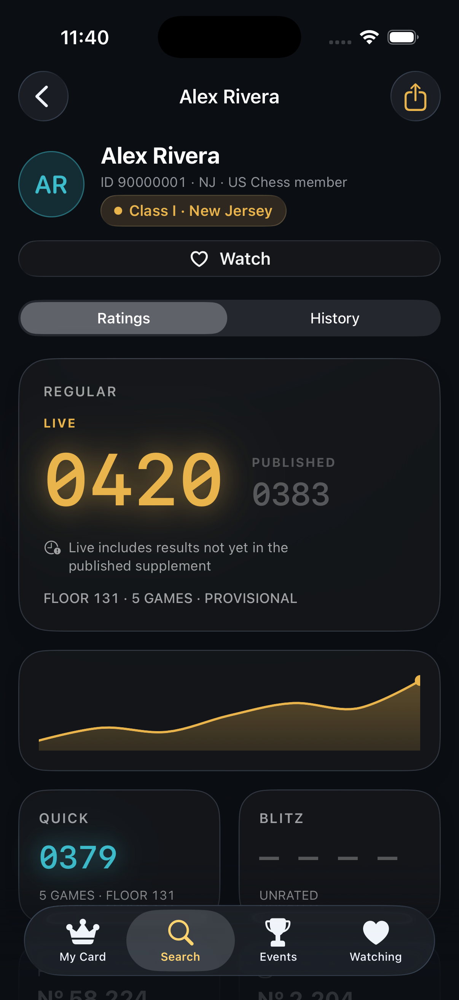 |  |

| Upcoming near me | Tournament detail | Top 100 by age | Watching | Search |
|:---:|:---:|:---:|:---:|:---:|
|  | 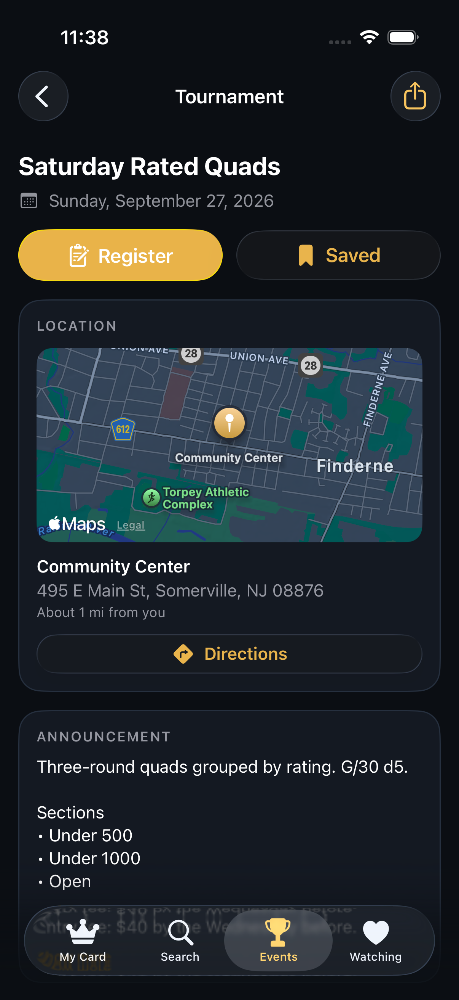 | 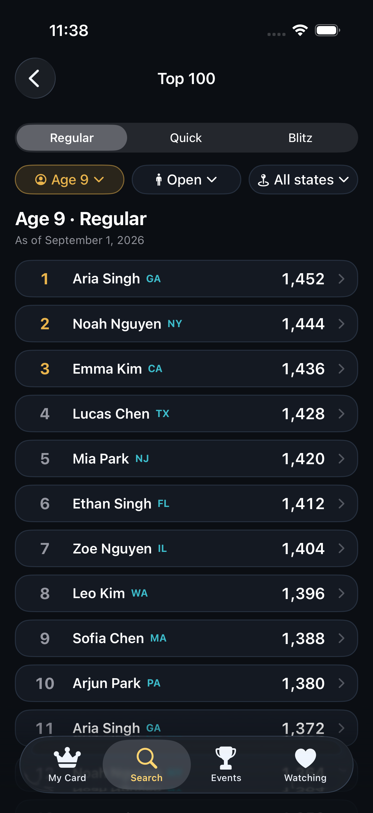 | 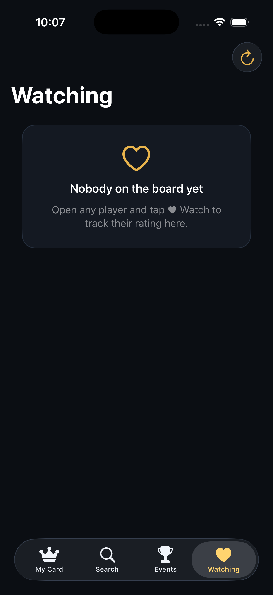 | 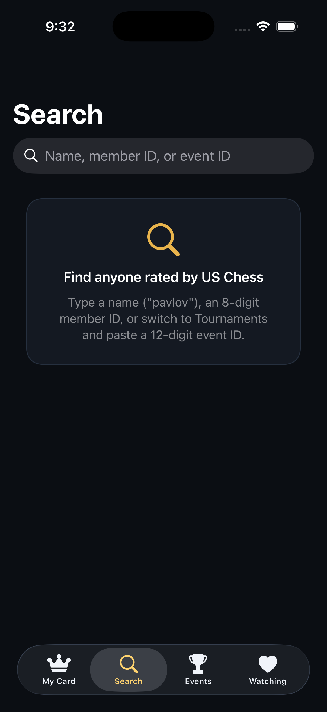 |

### iPad Pro 13"  ·  `NavigationSplitView`

On iPad, OpenBoard uses a sidebar (tabs + your watchlist) with a detail pane, and
supports Slide Over, Split View, and Stage Manager.

<p align="center">
  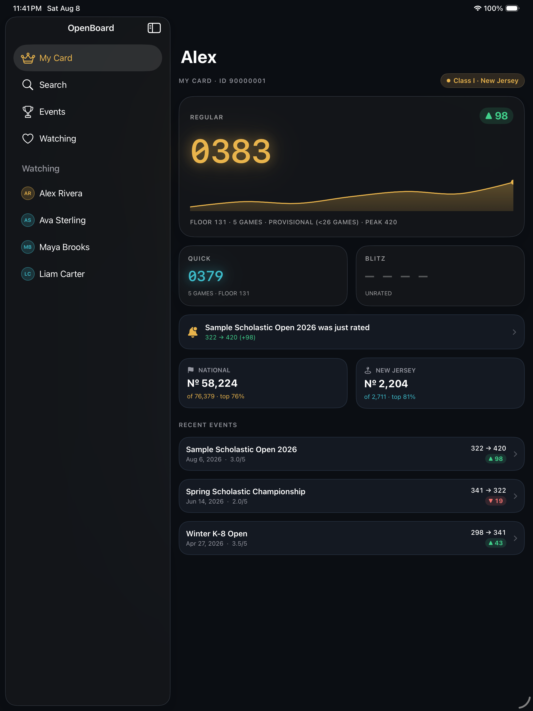
  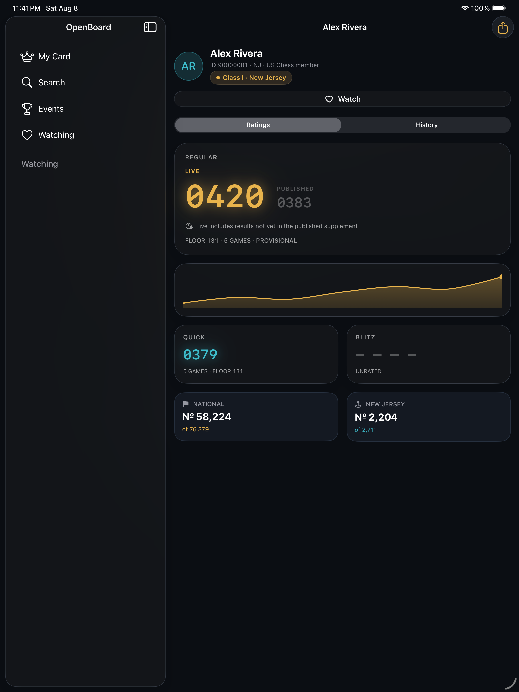
</p>
<p align="center">
  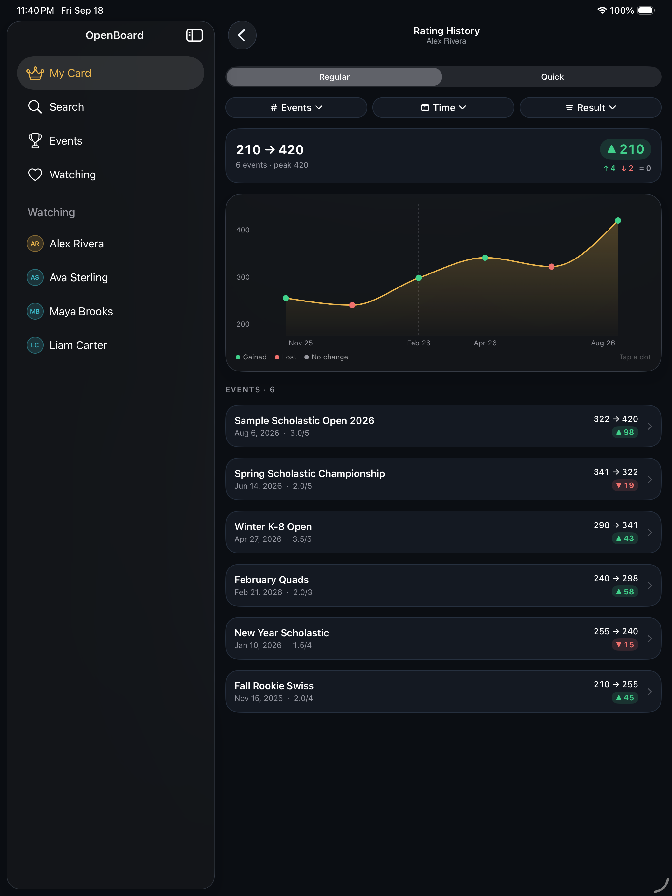
  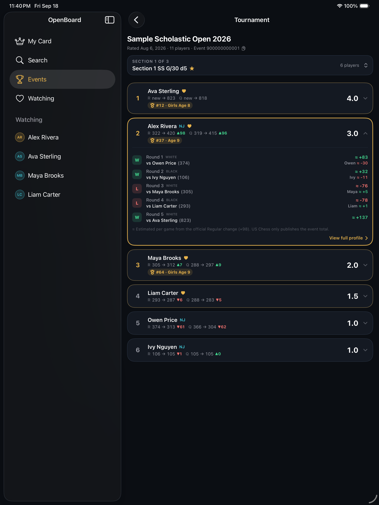
</p>
<p align="center">
  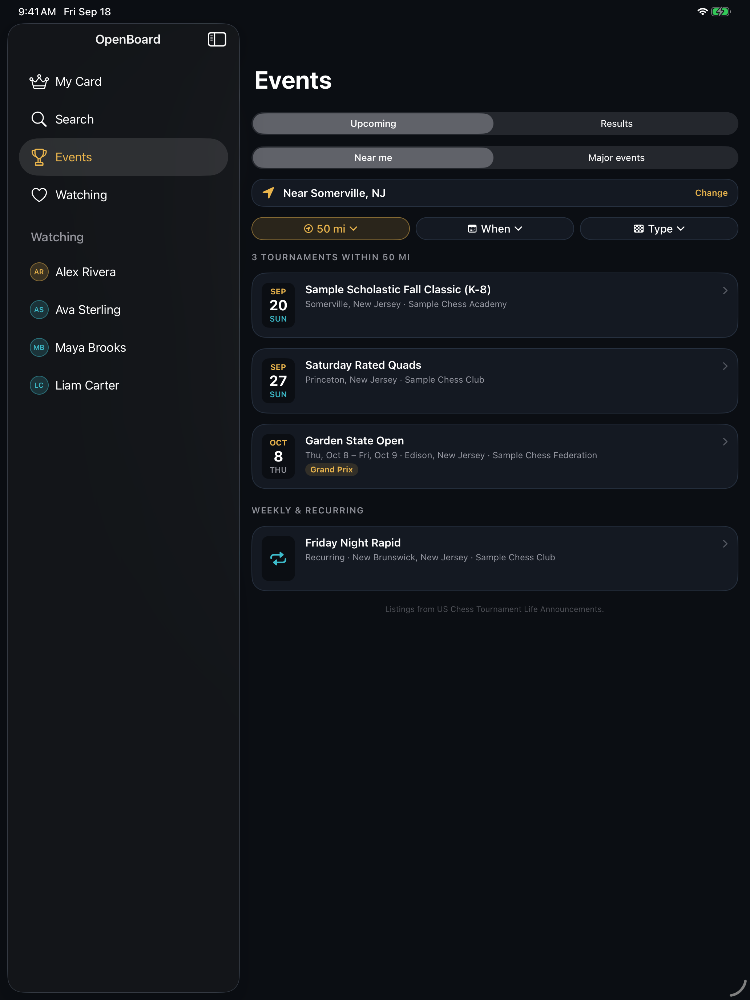
  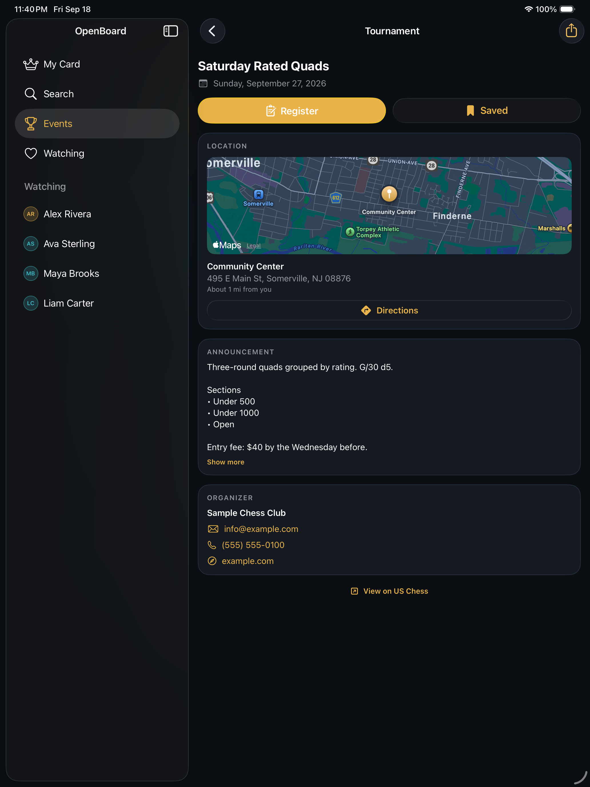
</p>
<p align="center">
  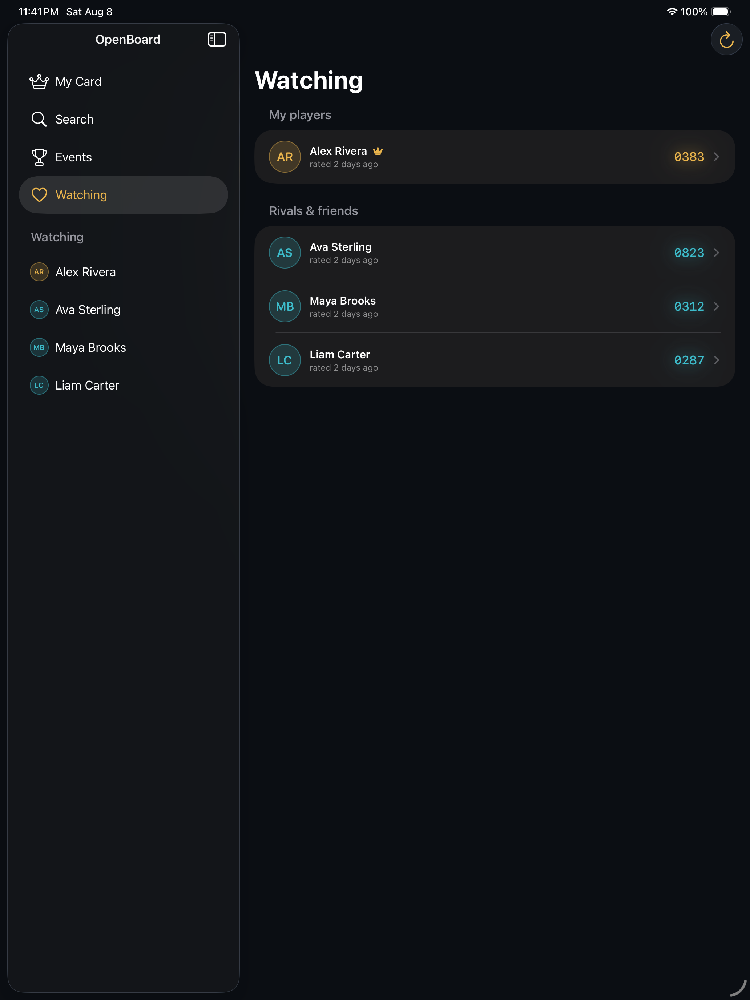
</p>

---

## References & prior art

- **MUIR announcement** — https://new.uschess.org/news/introducing-muir-member-uploads-information-and-reporting
- **Live OpenAPI/Swagger spec** — https://ratings-api.uschess.org/swagger/v1/swagger.json
- **`uschess-go`** (unofficial open-source Go client) — https://github.com/mikeb26/uschess-go
- **glitchess.com** — a similar (closed-source) product, noted as inspiration for future features.

### Possible future features
Not built yet — candidates inspired by similar trackers:
- Head-to-head compare between two watched players.
- Rating projection / "what a result would do to your rating" estimator.
- Affiliate/club pages (the MUIR API exposes `/affiliates`).
- Add a tournament to Calendar; save favorite tournaments.

---

*Not affiliated with or endorsed by the US Chess Federation. Data comes from the
MUIR backend, which is not a formally supported public API and may be inaccurate or
unavailable.*
